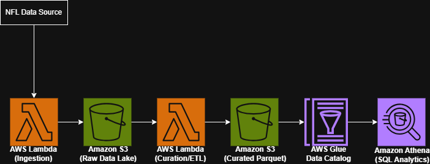
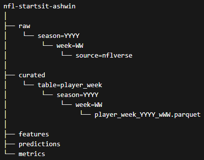

# Serverless Sports Analytics Data Pipeline (AWS)
Production-style serverless data pipeline for ingesting, transforming, and analyzing weekly NFL player performance data using AWS.

## Overview

This project implements a **serverless data pipeline on AWS** that ingests, transforms, and analyzes weekly NFL player performance data.

The system collects player statistics, stores raw data in an S3 data lake, transforms it into curated Parquet datasets, and enables SQL-based analytics using **AWS Glue** and **Amazon Athena**.

The goal of this project is to simulate a production-style **data lake architecture** where storage, transformation, and query layers are separated to enable scalable and cost-efficient analytics.

## Key Skills Demonstrated

- Serverless data pipelines
- AWS Lambda ETL workflows
- Data lake architecture
- Parquet optimization for analytics
- SQL analytics using Amazon Athena
- Metadata management with AWS Glue

---

## Architecture

The pipeline follows a layered data lake architecture:



This design separates **storage (S3)** from **compute (Athena)** and allows serverless analytics without provisioning databases or infrastructure.


---

## Data Lake Structure

The project uses a structured S3 layout to separate raw and curated data.



---

## Layers

### Raw Layer

Stores unmodified source data for traceability and reprocessing.

### Curated Layer

Cleaned and structured datasets stored in **Parquet format** for efficient analytics.

### Feature Layer (Planned)

Derived features used for modeling and predictions.

---

## Technologies Used

### AWS Services

- Amazon S3  
- AWS Lambda  
- AWS Glue Data Catalog  
- Amazon Athena  

### Programming & Tools

- Python  
- Pandas  
- SQL  
- Parquet  
- Boto3  

---

## Pipeline Components

### 1. Data Ingestion

A Lambda function retrieves weekly NFL player statistics and writes them to the **raw data layer in S3**.

#### Responsibilities

- Pull weekly player statistics  
- Validate required columns  
- Generate row count and checksum  
- Store data in the raw S3 layer  

Example output location:
`s3://nfl-startsit-ashwin/raw/season=2024/week=03/source=nflverse/`

---

### 2. Data Curation

A second Lambda function transforms the raw dataset into a **clean curated dataset**.

#### Processing steps include

- Schema validation  
- Null handling  
- Column normalization  
- Conversion to Parquet format  

Curated output example:
`s3://nfl-startsit-ashwin/curated/table=player_week/season=2024/week=03/`

---

### 3. Metadata Catalog

The curated datasets are registered in the **AWS Glue Data Catalog**, which acts as the metadata layer for the data lake.

Example table:
`ff_analytics.player_week_stats`


The table references the curated S3 location and allows Athena to query the data directly.

---

### 4. Analytics Layer

Amazon Athena enables **SQL queries directly against the curated datasets stored in S3**.

#### Top performing players

```sql
SELECT
    player_name,
    position,
    fantasy_points_ppr
FROM ff_analytics.player_week_stats
WHERE season = 2024
AND week = 3
ORDER BY fantasy_points_ppr DESC
LIMIT 20;
```

#### Breakout Usage Detection

Identifies players whose target volume increased week-over-week.

```sql
WITH usage_trend AS (
    SELECT
        player_name,
        targets,
        week,
        LAG(targets) OVER (PARTITION BY player_id ORDER BY week) AS prev_targets
    FROM ff_analytics.player_week_stats
)

SELECT
    player_name,
    targets,
    prev_targets,
    targets - prev_targets AS target_change
FROM usage_trend
WHERE prev_targets IS NOT NULL
AND targets - prev_targets >= 3
ORDER BY target_change DESC;
```
#### Data Completeness Validation
Checks for missing values and row counts.
```sql
SELECT
    season,
    week,
    COUNT(*) AS total_rows
FROM ff_analytics.player_week_stats
GROUP BY season, week
ORDER BY season, week;
```


## Key Design Principles
## Serverless Architecture
All compute components are serverless:

* Lambda handles ingestion and transformation
* Athena performs analytics queries

This eliminates infrastructure management.

## Separation of Storage and Compute
Data is stored in S3, while Athena performs queries only when needed.
This model provides a cost-efficient analytics platform.

## Data Lake Layering
The pipeline separates:

* Raw data
* Curated datasets
* Derived features
* Predictions

This makes it easier to reprocess data and maintain reliable analytics workflows.

## Future Improvements
Planned enhancements include:

* Feature engineering layer for predictive modeling
* Weekly automated pipeline orchestration
* Player projection model for fantasy decision support
* Backtesting framework for evaluating model performance
* Dashboard for visualizing weekly player projections

## Project Motivation
This project was built to gain hands-on experience designing and implementing cloud-based data pipelines using AWS services commonly used in production analytics systems.

It demonstrates:

* Data ingestion
* ETL pipeline design
* Data lake architecture
* Serverless analytics
* SQL-based exploration of curated datasets

## Author
**Ashwin Kuruchi**

B.S. Computational Modeling & Data Analytics

